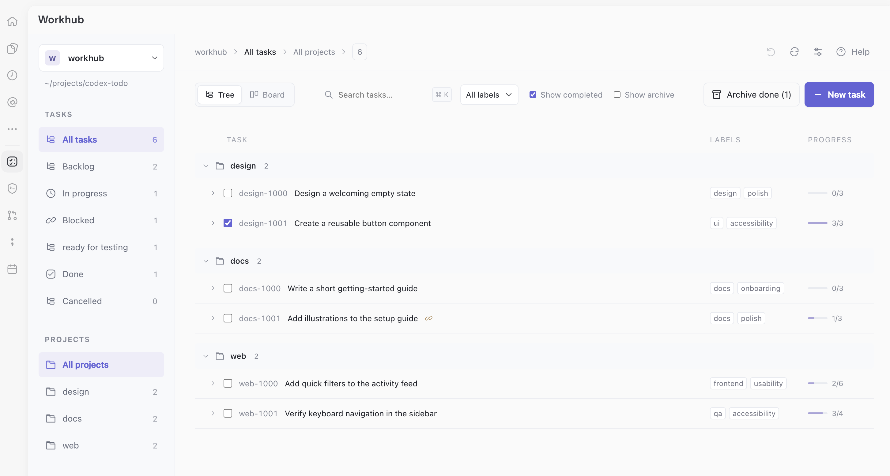
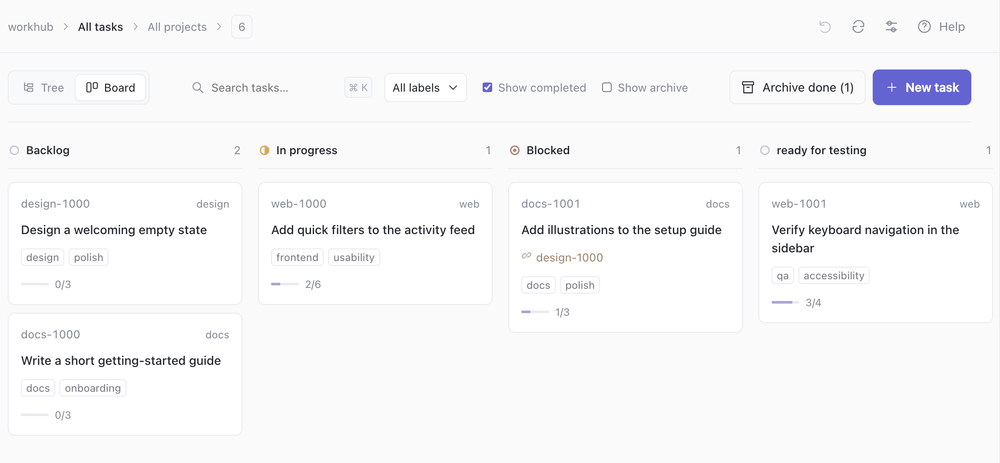
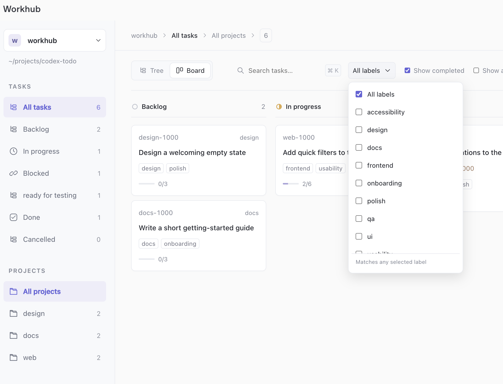
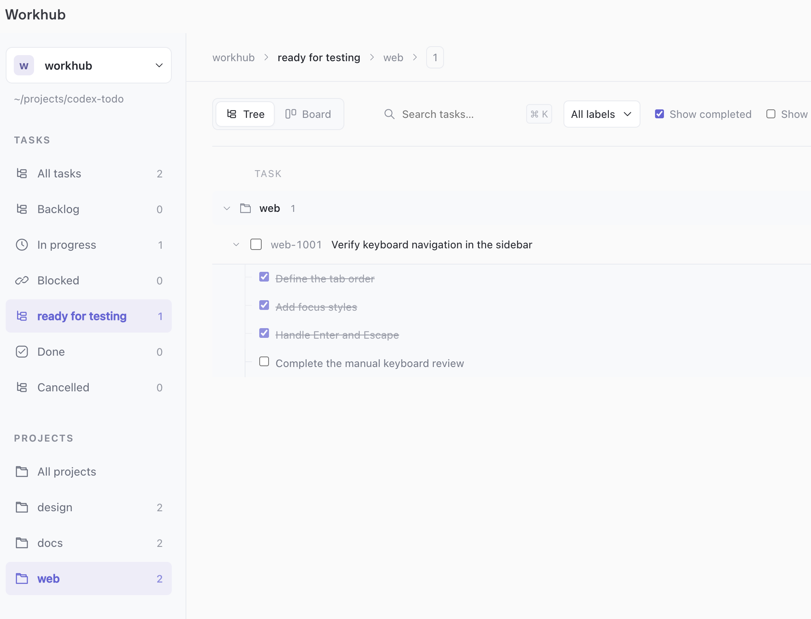

# Workhub

A local Codex plugin for Markdown tasks. Browse a tree or kanban board, search,
create and edit tasks, change status, and archive completed work. Your files stay
the source of truth.

## See it in action

These screenshots use fictional demo tasks.

**Tree view** groups tasks by project and shows labels and checklist progress.



**Board view** organizes tasks by status, including custom statuses such as
`ready for testing`, and shows linked blockers.



**Label filters** let you select several labels. Tasks matching any selected
label appear in the tree and board.



**Checklists** expand inside the tree. Project and status filters help focus on
the next step.



## Install

Requires Node.js 22.12 or newer on Codex's PATH.

Download and extract the ZIP from [Releases](https://github.com/rzaytsev/workhub/releases),
or clone the repository:

```sh
git clone https://github.com/rzaytsev/workhub.git
cd workhub
```

Inside the extracted or cloned `workhub/` folder, run:

```sh
codex plugin marketplace add .
codex plugin add workhub@workhub
```

The server and UI are bundled; no build or API key is needed. Restart Codex or
open a new chat, then open **Workhub**.

## Get started

Connect your project and task folder in Workhub. If the folder is missing,
Workhub asks before creating it. New projects use TOML tasks in `todo/*.md`;
existing `todo/tasks/` layouts remain supported. Legacy YAML is browse-only.
On macOS, **Browse workspace** and **Browse task folder** open the system folder
chooser. You can cancel Browse, close the form, or enter a path manually while
waiting; picker failures never lock the connection form.

To initialize a project with three relevant example tasks, ask Codex:

```text
$todo init /path/to/project
```

This is an experimental plugin. Native Codex chat behavior and installation on
a second machine still need verification; see the [acceptance limits](docs/sharing.md#acceptance-limits).

## Documentation

- [Installation and compatibility](docs/installation.md)
- [Usage and shortcuts](docs/usage.md)
- [Task skill](docs/task-skill.md)
- [Task-file format](docs/shared-format.md)
- [Development and validation](docs/development.md)
- [Distribution and release CI](docs/sharing.md)
- [Privacy](docs/privacy.md)

MIT; see [LICENSE](LICENSE) and [dependency notices](docs/third-party-notices.md).
Report bugs in [GitHub Issues](https://github.com/rzaytsev/workhub/issues), with
private task content removed.
